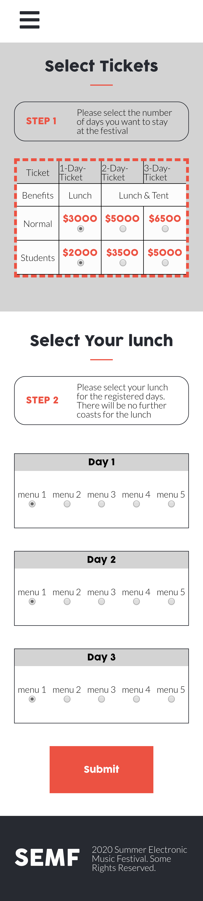
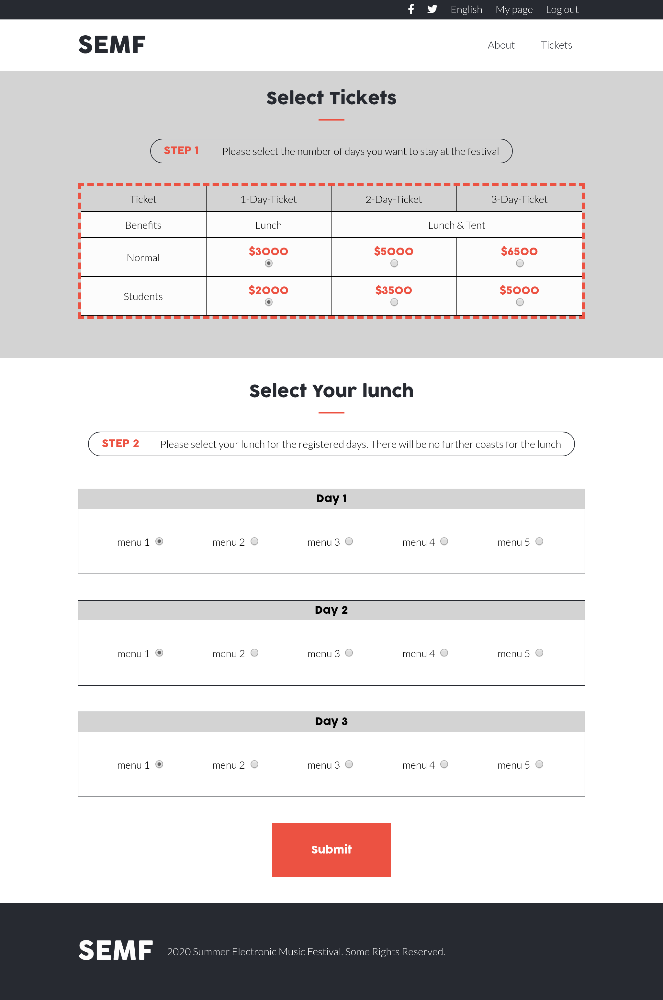
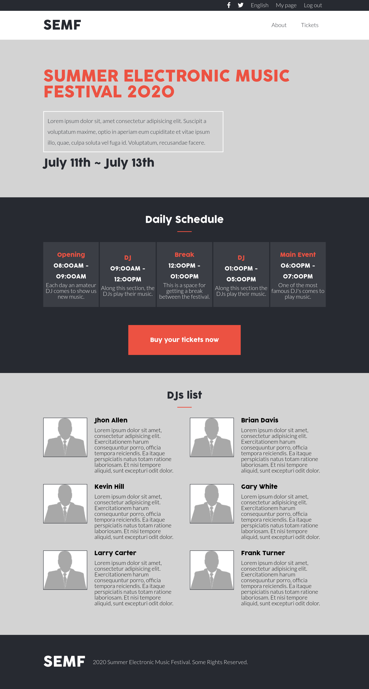
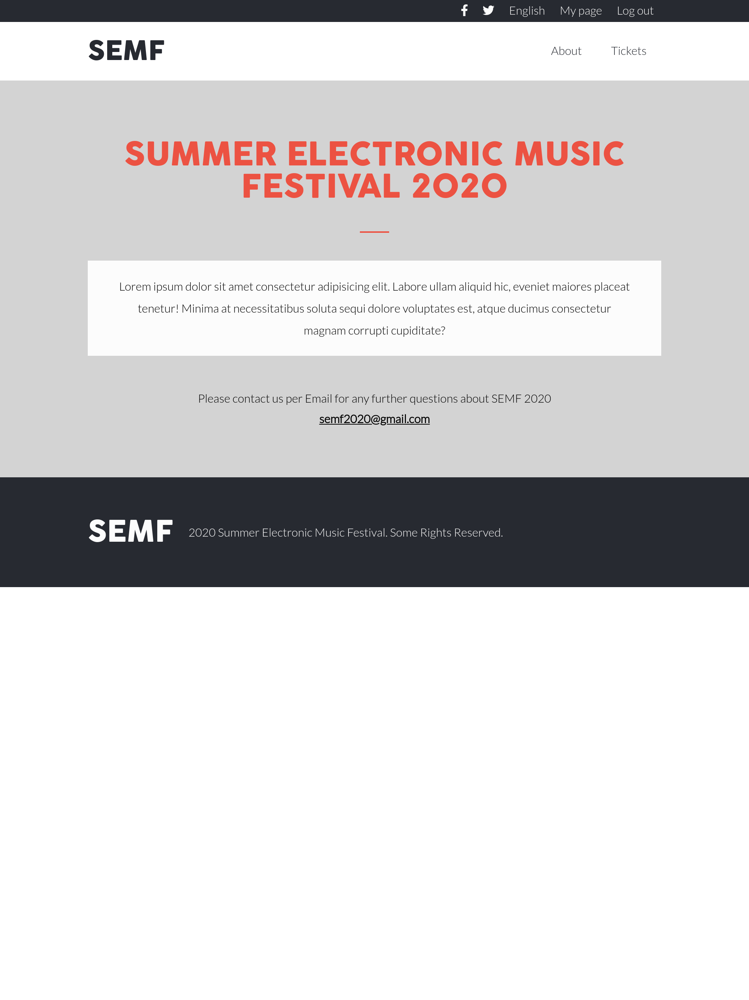

# Electronic Music Festival Page

> This website was designed following the design idea of [Cindy Shin](https://www.behance.net/gallery/29845175/CC-Global-Summit-2015).

This project has 3 pages and there are 2 versions on each page for diferents screen sizes(mobile and desktop size).

## Built With

- HTML,
- CSS,
- SASS

## Live Demo

[Live Demo Link](https://livedemo.com)

## Authors

👤 **Luis Octavio Ramirez Cruz**

- Github: [@LOctavio](https://github.com/LOctavio)
- Twitter: [@Octavio_ram431](https://twitter.com/Octavio_ram431)
- Linkedin: [linkedin](https://www.linkedin.com/in/luis-octavio-ramirez-cruz-714521178/)

## 🤝 Contributing

Contributions, issues and feature requests are welcome!

Feel free to check the [issues page](https://github.com/LOctavio/music-festival/issues).

## Show your support

Give a ⭐️ if you like this project!

## Acknowledgments

- Design idea by [Cindy Shin](https://www.behance.net/adagio07)