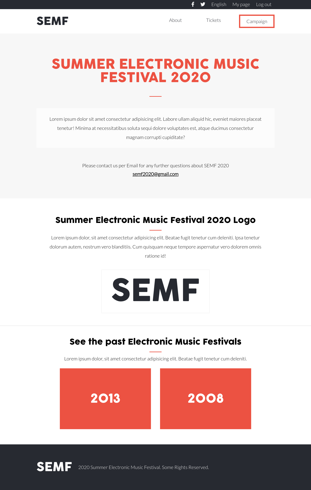
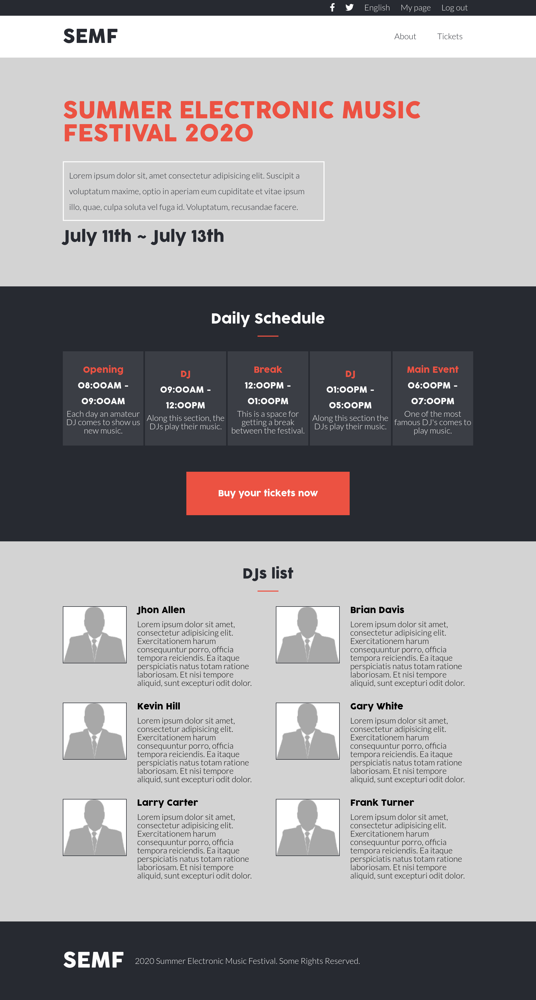
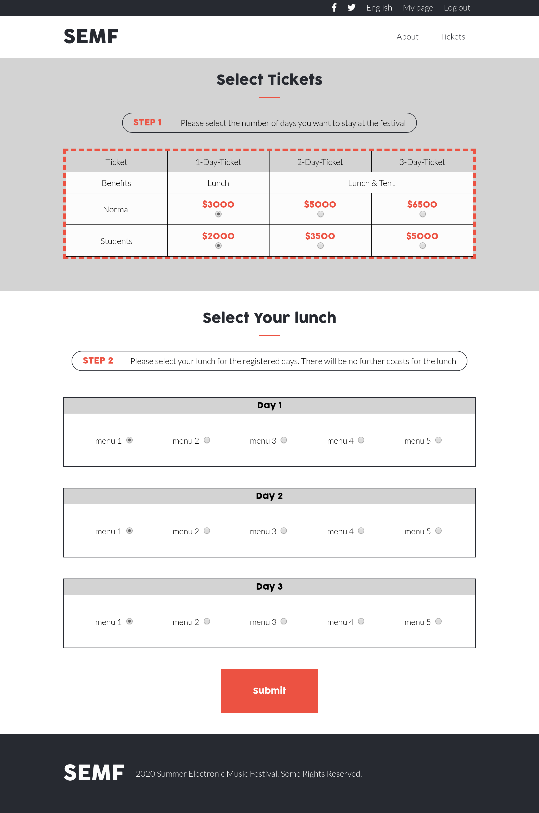

# Electronic Music Festival Page

> This website was designed following the design idea of [Cindy Shin](https://www.behance.net/gallery/29845175/CC-Global-Summit-2015).

This project has 3 pages and there are 2 versions on each page for diferents screen sizes(mobile and desktop size).

The first page is the main page (index). In this page there are a little description about the event, a schedule of each day during the event and a list with the djs who are going to play their music.

The second page is the tickets page. In this page we can buy tickets for the event and we can choose the number of days and the lunch that we want to have.

The third and last page is the about page. In this page we can read more information about the event and about previous events.

## Built With

- HTML,
- CSS,
- SASS

## Live Demo

[Live Demo Link](https://rawcdn.githack.com/LOctavio/music-festival/191eb50f09433e2f89e77071b10802b1bccbb988/index.html)

## Authors

👤 **Luis Octavio Ramirez Cruz**

- Github: [@LOctavio](https://github.com/LOctavio)
- Twitter: [@Octavio_ram431](https://twitter.com/Octavio_ram431)
- Linkedin: [linkedin](https://www.linkedin.com/in/luis-octavio-ramirez-cruz-714521178/)

## 🤝 Contributing

Contributions, issues and feature requests are welcome!

Feel free to check the [issues page](https://github.com/LOctavio/music-festival/issues).

## Show your support

Give a ⭐️ if you like this project!

## Acknowledgments

- Design idea by [Cindy Shin](https://www.behance.net/adagio07)